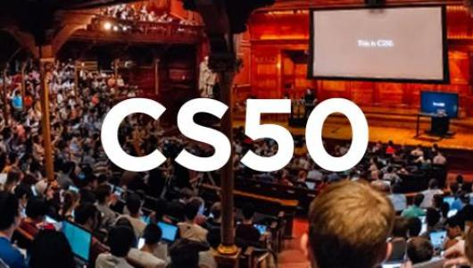

    
    <h1><b>2020 Harvard University's CS50x</b>: Introduction to the intellectual enterprises of computer science and the art of programming</h1>

"CS50x is a course that teaches students how to think algorithmically and solve problems efficiently. Topics include **abstraction, algorithms, data structures, encapsulation, resource management, security, and software engineering**. Languages include **C, Python, and SQL plus students’ choice of: HTML, CSS, and JavaScript (for web development); Java or Swift (for mobile app development); or Lua (for game development)**. Problem sets inspired by the arts, humanities, social sciences, and sciences. Course culminates in a final project. Designed for concentrators and non-concentrators alike, with or without prior programming experience." [Watch this introduction video.](https://youtu.be/3oFAJtFE8YU)

> Please don't copy the solutions from this repository. Keep in mind [Academic Honesty](https://cs50.harvard.edu/x/2020/syllabus/#academic-honesty). There are many great communities for support and help, such as [CS50 Stack Exchange](https://cs50.stackexchange.com/), the [CS50 Subreddit](https://www.reddit.com/r/cs50/) and the [CS50 Slack](http://cs50.edx.org/slack) to name a few. Investing your time and energy into solving each and every problem set independently is the best way to experience the course.

## Problem Sets  
The course is taught through a seven-week combo of online classes (available at YouTube) and problem sets. You can access all the course's materials at [CS50x's website.](https://cs50.harvard.edu/x/2020/)

### pset1 - Introduction to C (C)

- [Hello, world!](pset1/hello/)
> Implement a program to print adjacent pyramids using the "#" character, just like the pyramids from Mario.
- [Mario](pset1/mario/)
> Implement a program that checks if a credit card number is valid, using Luhn's algorithm.
- [Credit](pset1/credit/)

### pset2 - Arrays (C)

- [Readability](pset2/readability/readability.c)
> Implement a program that implements a substitution cipher, given an alternate alphabet.
- [Substitution](pset2/caesar/)

### pset3 - Algorithms (C)

> Implement programs that runs [Plurality](https://en.wikipedia.org/wiki/Plurality_voting) and [Runoff](https://www.ncsl.org/research/elections-and-campaigns/primary-runoff-elections.aspx) elections.

- [Plurality](pset3/plurality/)
- [Runoff](pset3/runoff/)

### pset4 - Memory (C)

> Implement a program that filters images with popular filters such as sepia, blur and grayscale.

- [Filter](pset4/filter/)
> Implement a program that recovers JPEGs from a forensic image.
- [Recover](pset4/recover/)

### pset5 - Data Structures (C)

> Implement a program that spell-checks a file.
- [Speller](pset5/speller/))

### pset6 - Introduction to Python (Python)

> Implement the previous programs in Python
- [Hello, world!](pset6/hello/)
- [Mario](pset6/mario/)
- [Cash](pset6/cash/)
- [Readability](pset6/readability/)
> Implement a program that identifies a person based on their DNA from [Short Tandem Repeats](https://en.wikipedia.org/wiki/STR_analysis) (STRs)
- [DNA](pset6/dna/)

### pset7 - Introduction to SQL (SQL)

> Solve this nice set of SQL challenges and exercises.
- [Movies](pset7/movies)
- [Houses](pset7/houses/roster.py)

### pset8 - Web Track (HTML, CSS, JavaScript, Flask, SQL)

> Implement a personal homepage.
- [Homepage](pset8/homepage)
> Implement a full stack web application in which users can simulate investing into stocks, including user registration and real time stock prices.
- [Finance](pset8/finance)

### Final Project
> Build something of interest to you, that you solve an actual problem, that you impact your community, or that you change the world. Strive to create something that outlives this course.

  

For this Final Project, I teamed up with [a friend](github.com/weltonfelix) to build a platform (called Cookit!) where you can search for recipes based on the ingredients you have in your home, instead of searching only for the name of the recipe. The video presentation of the project is [available at Youtube](https://youtu.be/QfpLtNVWxLg) and the repo with code is [available at Github](https://github.com/weltonfelix/cookit).